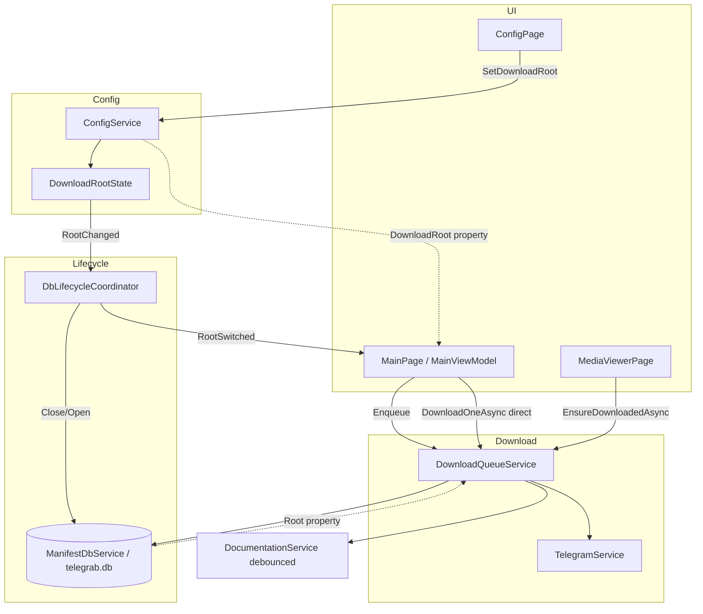

# Audit Kode: `src/Telegrab`

Audit ini membaca alur sekuensial/paralel langsung dari kode — **bukan** dari spec atau hasil test. Test di proyek ini dominan di layer “logika murni” (`CaptionResolver`, `ManifestDbService`, `DocumentationRenderer`); hampir **tidak ada** coverage untuk race condition UI, WTelegram, atau unduhan nyata.

> **Asumsi global: TIDAK ADA MIGRASI.** Aplikasi belum punya pengguna/data produksi. Semua perubahan skema folder maupun skema DB manifest boleh dilakukan langsung tanpa kompatibilitas mundur atau langkah migrasi. Saran perbaikan di dokumen ini mengikuti asumsi ini.

---

## Ringkasan Eksekutif

Aplikasi ini sudah punya fondasi yang cukup matang: antrian unduh sekuensial, kunci per-media, lifecycle DB terkoordinasi, dan pemisahan logika murni vs MAUI. Tapi ada **celah integritas data**, **masalah performa yang akan terasa di skala nyata**, dan **UX yang membingungkan** — terutama forum, folder naming, dan unduhan langsung vs antrian.

---

## 1. Bug & Risiko Integritas Data

### 1.1 Kolisi folder: judul chat/topik saja (KRITIS)

Path unduhan hanya memakai judul yang disanitasi, **tanpa** `chat_id` / `topic_id`:

```584:599:d:\GitHub\Telegrab\src\Telegrab\Services\TelegramService.cs
    public string BuildTargetPath(string root, DownloadContext ctx, MediaPart part)
    {
        var folder = Path.Combine(root, SanitizeName(ctx.ChatTitle, "chat"));
        if (!string.IsNullOrWhiteSpace(ctx.TopicTitle))
            folder = Path.Combine(folder, SanitizeName(ctx.TopicTitle!, "topic"));
        // ...
        var name = $"{datePrefix}{part.MessageId}_{part.MediaId}_{SanitizeFileName(part.FileName)}";
```

**What if?** Dua channel/grup bernama `"News"` → file masuk folder yang sama. Manifest DB membedakan lewat `chat_id`, tapi **file di disk saling timpa** atau tercampur. Topik forum dengan judul sama dalam satu supergroup → subfolder sama.

Ini bukan edge case — ini desain yang rapuh untuk pengguna Telegram yang join banyak grup.

> **Catatan migrasi: TIDAK ADA.** Belum ada pengguna/data lama, jadi perubahan skema folder (mis. `{chatId}_{title}`) dan/atau skema manifest dapat dilakukan **langsung tanpa langkah migrasi**. Tidak perlu menulis kode kompatibilitas mundur, tidak perlu memetakan ulang `relative_path` lama. Folder/DB lama (kalau ada saat dev) cukup dihapus dan dibuat ulang.

> **Judul tidak dapat dipercaya sebagai sumber keunikan/validitas (unicode & emoji).** `SanitizeName` saat ini hanya mengganti `Path.GetInvalidFileNameChars()` + trim titik/spasi; **emoji dan karakter non-ASCII lolos apa adanya**. Ini rapuh lintas filesystem (FAT/exFAT, network/SMB share), encoding terminal, serta beberapa tool arsip/sinkronisasi. Kasus ekstrem: judul yang seluruhnya emoji → setelah sanitasi bisa kosong → jatuh ke fallback `"chat"`/`"topic"` → **kolisi balik lagi**.
>
> Karena itu skema folder harus berbentuk **`{id}_{judul-disanitasi}`** dengan `id` (`chatId`/`topicId`) sebagai **anchor**:
> - **Keunikan & integritas dipikul oleh `id`**, bukan judul — folder tetap unik & deterministik walau judul kosong, identik, atau gagal ter-render.
> - **Judul murni dekoratif/keterbacaan.** Disarankan sanitasi lebih agresif: batasi ke subset aman (mis. buang/normalisasi non-ASCII & emoji, batasi panjang mis. 60–80 char untuk menghindari limit `MAX_PATH` Windows), dan judul **boleh kosong** tanpa merusak keunikan (`{id}` saja sudah valid).
> - Pola `{id}_{judul}` (prefix) lebih disukai daripada suffix agar folder ter-sort & ter-group per-chat secara natural di Explorer.

---

### 1.2 `HasActiveWork` tidak melihat unduhan langsung (BUG B3 incomplete)

`ConfigViewModel` memblokir ganti root jika antrian aktif:

```94:99:d:\GitHub\Telegrab\src\Telegrab\ViewModels\ConfigViewModel.cs
        if (_queue.HasActiveWork)
        {
            HasError = true;
            StatusText = "Tidak dapat mengubah folder saat unduhan masih berjalan. " +
```

Tapi `HasActiveWork` hanya mengecek `Jobs` di antrian:

```55:55:d:\GitHub\Telegrab\src\Telegrab\Services\DownloadQueueService.cs
    public bool HasActiveWork => Jobs.Any(j => j.IsActive || j.State == DownloadState.Queued);
```

Unduhan lewat `DownloadPartAsync` / `EnsureDownloadedAsync` memanggil `DownloadOneAsync` **tanpa** job di `Jobs`.

**What if?** User klik Download pada satu media (bukan antrian), lalu buka Configuration dan ganti folder:
1. `DbLifecycleCoordinator` menutup DB
2. Unduhan masih jalan ke path root **lama**
3. `_db.Mark()` gagal → file yatim di root lama, tidak tercatat di DB root baru

Test unit **tidak** mensimulasikan jalur paralel ini.

---

### 1.3 Pembatalan unduhan tidak menghentikan transfer file

```637:648:d:\GitHub\Telegrab\src\Telegrab\Services\TelegramService.cs
            while (true)
            {
                ct.ThrowIfCancellationRequested();
                try
                {
                    await using (var fs = File.Create(destinationPath))
                    {
                        if (part.Photo is { } photo)
                            await Client.DownloadFileAsync(photo, fs, (PhotoSizeBase?)null, Report);
```

`CancellationToken` hanya dicek **sebelum loop** dan saat `FLOOD_WAIT`. `DownloadFileAsync` tidak menerima token → Cancel All / Cancel job **tidak** menghentikan transfer aktif; user menunggu file selesai (bisa GB).

---

### 1.4 Race root switch vs worker antrian

Urutan saat ganti root:
1. `ConfigService.SetDownloadRoot` → `RootChanged`
2. `DbLifecycleCoordinator`: `_db.Close()` → buka DB baru
3. `MainViewModel`: `_queue.CancelAll()` (async, tidak di-await)

**What if?** Worker sedang di `_db.Mark()` setelah `DownloadToPathAsync` selesai, DB sudah ditutup → exception → job Failed, file ada di disk root lama tanpa entri di DB aktif.

`CancelAll` tidak menunggu worker; tidak ada barrier “semua unduhan selesai” sebelum `Close()`.

---

### 1.5 `Mark()` setelah unduh tanpa transaksi atomik

Alur: tulis file → `_db.Mark()`. Jika `Mark()` gagal (DB closed, disk full, dll.), file sudah ada di disk tapi manifest tidak konsisten. Re-unduh akan menimpa file; README debounce mungkin tidak pernah terpicu.

---

### 1.6 Album merge hanya untuk item **berdekatan** dalam satu halaman

```252:264:d:\GitHub\Telegrab\src\Telegrab\Services\TelegramService.cs
            if (item.GroupedId != 0 && merged.Count > 0 && merged[^1].GroupedId == item.GroupedId)
            {
                var prev = merged[^1];
                foreach (var m in item.Media)
                    prev.Media.Add(m);
```

**What if?** Anggota album terpisah oleh pesan lain di response API, atau terpotong di batas paginasi → album terpecah di UI, caption hanya di anggota pertama, dokumentasi README bisa salah grup.

---

### 1.7 `MediaId == 0` di-skip diam-diam

```97:99:d:\GitHub\Telegrab\src\Telegrab\Services\DownloadQueueService.cs
            if (part.MediaId == 0) continue;
```

Media tanpa id valid tidak bisa diunduh dan tidak ada feedback ke user.

---

### 1.8 Record DB yatim saat file dihapus manual

`IsDownloaded` cek `File.Exists` → UI menampilkan “belum unduh”. Baris DB tetap ada sampai re-download upsert. `QueryFolder` filter file hilang, tapi DB membengkak dan statistik folder tidak akurat.

---

## 2. Performance Issues

### 2.1 Unduhan sekuensial — ~~mahal~~ **(DROP: desain sengaja)**

> **Di-drop sebagai isu.** `tech.md` & `product.md` menyatakan unduhan sekuensial via `Channel<DownloadJob>` adalah **keputusan desain sadar** ("ramah rate-limit Telegram", penanganan `FLOOD_WAIT`). Saran "2–3 paralel dengan semaphore" justru **berisiko memperburuk** FLOOD_WAIT dan bertentangan dengan prinsip read-only-aman terhadap Telegram. Biaya O(n) untuk batch besar diterima sebagai tradeoff sadar, bukan bug. Tidak ada tindakan.

---

### 2.2 Progress flood ke UI thread

```485:490:d:\GitHub\Telegrab\src\Telegrab\Services\DownloadQueueService.cs
        public void Report(double value)
            => MainThread.BeginInvokeOnMainThread(() =>
            {
                _job.Progress = value;
                _job.Part.Progress = value;
            });
```

WTelegram memanggil callback progress sangat sering → **ribuan `BeginInvokeOnMainThread`** per file besar → UI jank, terutama saat scroll + unduhan + thumbnail paralel.

**What if?** Unduh 500 MB sambil scroll chat → frame drop.

---

### 2.3 `ApplyManifestStateAsync`: N query DB + N × `File.Exists`

```298:308:d:\GitHub\Telegrab\src\Telegrab\ViewModels\MainViewModel.cs
        var resolved = await Task.Run(() =>
        {
            var hits = new List<(MediaPart Part, string Path)>();
            foreach (var part in pending)
            {
                if (_db.IsReady && _db.IsDownloaded(chatId, part.MessageId, part.MediaId, out var path))
                    hits.Add((part, path));
```

Halaman 50 pesan × album 10 media = **500 query SQLite + 500 stat disk** per load/load-more. Seharusnya batch query (`WHERE chat_id = ? AND message_id IN (...)`).

---

### 2.4 `QueryFolder("")` memuat **seluruh** tabel media

```231:234:d:\GitHub\Telegrab\src\Telegrab\Services\ManifestDbService.cs
                command.CommandText =
                    "SELECT * FROM media ORDER BY message_date_utc, message_id, media_id;";
```

Dipakai regenerasi README. **What if?** 50.000 unduhan → setiap debounce/rebuild baca full table, filter di memory, N × `File.Exists`.

---

### 2.5 `GetChatsAsync`: semua chat sekaligus, tanpa paginasi

User di ratusan grup → satu RPC besar + render sidebar + thumbnail paralel (4 concurrent) → startup lambat.

---

### 2.6 Memori: `Messages` + objek TL + thumbnail tidak pernah dipangkas

`LoadMore` menambah ke `ObservableCollection` tanpa batas. Setiap `MediaPart` menyimpan `Photo`/`Document` WTelegram + `ImageSource` thumbnail. Scroll panjang = **memory leak praktis** untuk sesi lama.

---

### 2.7 Thumbnail vs unduhan: throttle 250 ms polling **(reframe: by-design)**

```112:118:d:\GitHub\Telegrab\src\Telegrab\Services\TelegramService.cs
        while (Volatile.Read(ref _activeDownloads) > 0)
        {
            ct.ThrowIfCancellationRequested();
            await Task.Delay(250, ct);
        }
```

> **Sebagian di-drop.** `tech.md` menyatakan throttle thumbnail selama unduhan berjalan adalah **perilaku yang disengaja** (prioritaskan bandwidth/kuota rate-limit untuk unduhan file penuh). Jadi *menahan* thumbnail bukan bug. Yang tersisa hanya saran **opsional non-prioritas**: ganti polling 250 ms jadi event-driven (mis. `TaskCompletionSource`/sinyal saat `_activeDownloads` kembali 0) agar thumbnail lanjut tanpa jeda hingga 250 ms. Bukan isu rilis.

---

## 3. UX / Design Issues

### 3.1 Forum: klik chat ≠ buka pesan (membingungkan)

```223:229:d:\GitHub\Telegrab\src\Telegrab\ViewModels\MainViewModel.cs
        if (chat.IsForum)
        {
            chat.IsExpanded = !chat.IsExpanded;
            // ...
            CurrentTitle = chat.Title;
            return;  // tidak ReloadAsync
        }
```

User klik forum → judul berubah, panel kanan **kosong**, tidak ada petunjuk “pilih topik”. Chevron `›` kecil saja; pola mental “klik chat = lihat pesan” rusak.

---

### 3.2 Campuran bahasa (ID/EN)

| Area | Bahasa |
|------|--------|
| Login, status utama, tombol | English |
| Config modal, beberapa toast docs | Indonesia |
| Error validasi root | Indonesia |

Terasa seperti dua produk digabung; tidak profesional untuk release.

---

### 3.3 Sidebar fixed 320px, layout 2 kolom kaku

`MainPage.xaml`: `ColumnDefinitions="320,*"`. Di layar kecil / window minimum 800px, area pesan sempit. Tidak ada collapse sidebar, tidak responsive.

---

### 3.4 ~~Tombol Download per tile + "Download all" + antrian — redundan~~ **(reframe: dua jalur memang fitur)**

> **Klaim "redundan" di-drop.** `product.md` Fitur #2 mendefinisikan **"Download All" (antrian batch)** dan **"Download per file" (unduh satu media langsung)** sebagai **dua fitur terpisah yang disengaja** — bukan redundansi. Yang tetap valid hanya soal **kejelasan UX**: pengguna sulit membedakan kapan sesuatu masuk antrian vs unduh langsung, dan panel antrian auto-clear 4 detik (lihat 3.5) membuat ringkasan cepat hilang. Tindakan: perjelas indikator visual jalur unduhan, bukan menghapus salah satu tombol.

---

### 3.5 Auto-clear antrian 4 detik

```409:416:d:\GitHub\Telegrab\src\Telegrab\Services\DownloadQueueService.cs
            if (idle && hasClearable) ScheduleAutoClear();
            else CancelAutoClear();
```

Job sukses hilang sebelum user sempat lihat ringkasan; job **Failed** tetap — bias visual (hanya error yang nempel).

---

### 3.6 Tidak ada logout / ganti akun

`TelegramService.Dispose()` ada, tapi tidak ada UI logout. Session `session.dat` persisten; singleton `MainViewModel`/`LoginViewModel` — restart app saja yang “reset” navigasi.

---

### 3.7 `Sender` hampir selalu kosong di manifest

```422:424:d:\GitHub\Telegrab\src\Telegrab\Services\TelegramService.cs
        var sender = postAuthor;
```

Hanya `post_author` channel; user biasa/grup → README tanpa nama pengirim.

---

### 3.8 Icon dokumentasi di header tanpa label

Tombol `Description`, `Settings`, `Refresh` — icon-only. Accessibility/description ada, tapi discoverability rendah.

---

## 4. Data Flow yang Membingungkan



**Pain points:**

1. **Dua sumber “root”**: `_config.DownloadRoot` vs `_db.Root` — seharusnya satu truth; fallback `_db.Root ?? _config.DownloadRoot` di `OpenDocumentationAsync` menandakan ketidakkonsistenan potensial.
2. **`RootChanged` vs `RootSwitched`**: desain bagus (B4), tapi mudah dilanggar jika developer baru subscribe ke `RootChanged` langsung.
3. **Unduhan**: satu method `DownloadOneAsync`, tiga entry point (antrian, tombol, viewer) — kunci per-media (B2) benar, tapi **tracking “active work”** tidak unified.
4. **Caption**: fetch pesan → `BuildPage` → adapt ke `MessageWindow` → `CaptionResolver` → copy balik via `MediaId` — pipeline panjang; fetch case-12 best-effort silent fail → caption inferred/none tanpa indikasi UI.

---

## 5. What-If Scenarios (Sequence & Parallel)

| Scenario | Prediksi dari kode | Test cover? |
|----------|-------------------|-------------|
| Double-click Download pada media sama | Kunci semaphore + `IsDownloading` check → aman | Tidak |
| Download + buka viewer media sama | `DownloadOneAsync` serial per key → aman | Tidak |
| Cancel All saat FLOOD_WAIT | Cancel token abort delay; loop retry | Tidak |
| Cancel All saat transfer aktif | Transfer lanjut sampai selesai | Tidak |
| Ganti root saat unduhan langsung | DB close, file yatim | Tidak |
| Dua chat judul sama | Folder disk sama, timpa/campur | Tidak |
| Load-more 200 halaman | Memori + ribuan TL object | Tidak |
| README rebuild folder besar | Full table scan | Sebagian (unit IO mock) |
| Forum expand tanpa pilih topik | UI kosong, title misleading | Tidak |
| Album split di pagination | UI album pecah | Tidak |

---

## 6. Dead Code & Artefak

| Item | Status |
|------|--------|
| `Platforms/Android`, `iOS`, `MacCatalyst` | **BUKAN dead** — `tech.md` menyatakan folder ini sengaja dipertahankan untuk target multi-platform di masa depan (Windows satu-satunya target build *aktif* saat ini). Jangan dihapus. |
| `ConfigService` baris comment `AppDataFolder = ...Telegrab` | Dead comment |
| `CaptionOptions` property non-default | Tidak pernah di-set dari UI; selalu `Default` |
| `MessageWindow(IEnumerable<...>)` ctor | Kemungkinan hanya untuk test |
| `ApplicationId` di csproj | Di-comment |
| `Resources/Images/dotnet_bot.png` | Template MAUI default? |
| Logout / session clear | Tidak diimplementasi |

---

## 7. Test Suite — Mengapa Tidak Boleh Dipercaya untuk Release

~82 test, fokus ke:
- `CaptionResolver`, `DocumentationRenderer`, `ManifestDbService`, `ConfigService` root state

**Tidak diuji (area risiko tertinggi):**
- `DownloadQueueService` worker, channel, key lock dispose
- `TelegramService` pagination, album merge, FLOOD_WAIT loop
- `MainViewModel` race thumbnail / manifest / root reload
- `DbLifecycleCoordinator` + unduhan concurrent
- Semua UI/XAML binding dan flow forum
- `MediaViewerPage` lifecycle / memory

Test “pass” **tidak** membuktikan aplikasi aman di production Telegram nyata.

---

## 8. Prioritas Perbaikan

### P0 — Integritas data
1. Path folder: `{chatId}_{sanitizedTitle}` / `{topicId}_{sanitizedTitle}`
2. Global `_activeDownloadCount` atau register di `DownloadQueueService` untuk **semua** jalur unduhan; block root change
3. Barrier: await worker idle sebelum `DbLifecycleCoordinator.Close()`

### P1 — Stability & UX
4. Throttle progress UI (mis. max 10 update/detik)
5. Batch manifest lookup per halaman
6. Cancellation: linked CTS + dispose stream / abort download (jika WTelegram mendukung)
7. Forum UX: empty state “Select a topic” + jangan set `CurrentTitle` seolah chat aktif

### P2 — Scale
8. Paginate chats; cap `Messages` in memory atau virtualize
9. `QueryFolder` dengan SQL prefix ketat, hindari full scan
10. Unifikasi bahasa UI

---

## Kesimpulan Jujur

Kode menunjukkan **engineering yang thoughtful** (B2 key lock, B4 RootSwitched, P2 manifest off UI thread, debounce README). Tapi aplikasi ini **belum production-hardened** untuk pengguna berat: kolisi folder by title, celah lifecycle root vs unduhan langsung, cancel palsu, dan performa O(n) di manifest/README akan muncul di skenario nyata — **bukan** di unit test.


---

## 9. Status Perbaikan — Sesi Implementasi

Ringkasan apa yang **sudah dikerjakan** pada sesi ini, dipisahkan jujur dari yang **masih terbuka**. Verifikasi: kompilasi C# + XAML 0 error (build `.exe` penuh tidak dijalankan karena proses app aktif mengunci output — murni file lock, bukan error kode), diagnostik bersih, dan **89/89 unit test lulus**. Perilaku runtime UI belum diuji manual.

### ✅ Sudah diperbaiki

**Bug logika**
- **B1 — album hilang di README.** `grouped_id` dialirkan penuh: `MediaPart.GroupedId` ← `TelegramService.MapMessage` (`msg.grouped_id`) → `DownloadQueueService.BuildRecord` menulis `group_id`. `DocumentationRenderer` kini benar-benar menggabungkan anggota album jadi satu post.
- **B2 — unduhan ganda media yang sama.** Kunci per-media (semaphore + refcount) di `DownloadOneAsync`, dengan re-cek `IsDownloaded` di dalam kunci. Worker antrian & unduhan langsung (tombol/viewer) tak lagi menulis file tujuan yang sama bersamaan.
- **B3 — blokir ganti folder saat unduh.** `DownloadQueueService.HasActiveWork` + guard di `ConfigViewModel.ChangeFolderAsync`. ⚠️ *Lihat butir terbuka 1.2 — belum mencakup unduhan langsung di luar antrian.*
- **B4 — urutan tukar-DB eksplisit.** `DbLifecycleCoordinator` jadi satu-satunya pelanggan `RootChanged`, lalu memancarkan `RootSwitched` setelah DB ditukar; `MainViewModel` berlangganan `RootSwitched` → DB dijamin siap sebelum reload UI.

**Performa**
- **P1 — UI beku saat mengunduh.** Thumbnail tak lagi ditahan di bawah `IsBusy`; dimuat di latar (fire-and-forget) dengan token batal.
- **P2 — lock DB menahan disk I/O.** `IsDownloaded`/`QueryFolder` mengunci hanya query DB; `File.Exists` di luar lock. `ApplyManifestState` dipindah ke thread pool, penerapan ke UI thread.
- **P3 — thumbnail paralel terbatas (4)** via `SemaphoreSlim`, assignment `ImageSource` tetap di-marshal ke UI thread.
- **P4 — daftar job dibatasi.** Pangkas job selesai > `MaxFinishedRetained = 100`, hitungan diringkas via `_prunedDone`.

**Design (kategori 3)**
- **3a** — `AccountConfig.DownloadFolder` / `ConfigService.SaveDownloadFolder` / `DefaultDownloadFolder` (dead) dihapus; `DownloadRoot` jadi satu-satunya sumber kebenaran folder.
- **3b** — tombol "Change" & ikon gear digabung ke `OpenConfigurationCommand`; command duplikat dihapus.
- **3c** — banner editor README dibedakan: sukses = hijau, peringatan/gagal = amber (`ShowBanner`/`BannerIsWarning`).
- **3d** — dokumentasi `DownloadContext.ChatId` diperjelas untuk kasus topik forum.

**Design (kategori 4)**
- **4a** — file unduhan berisiko (`.exe/.bat/.ps1/.msi/.lnk/...`) tidak lagi dieksekusi otomatis; ditampilkan di Explorer.
- **4b** — race edit README vs regenerasi: `DocumentationService.BeginEdit/EndEdit` menahan regenerasi ter-debounce selama folder disunting (Rebuild eksplisit tetap jalan).
- **4c** — `SqliteConnection.ClearAllPools()` global diganti `Pooling=False`.

**Data flow (kategori 5)**
- **5b** — `ConfigureAwait(false)` di jalur pesan/resolver `TelegramService` → kerja CPU resolver keluar dari UI thread.
- **5c** — sentinel `MediaId == 0` dijaga di `Enqueue`.

**Test**
- Tambah `CaptionResolverTests` (22) + `ManifestDbServiceTests` (18); total **89 lulus**. Sebelumnya `CaptionResolver` dan `ManifestDbService` (komponen paling kompleks) nol coverage.

### ⛔ Masih terbuka (belum dikerjakan)

| Ref | Isu | Catatan |
|-----|-----|---------|
| 1.1 | Kolisi folder by title (tanpa `chat_id`/`topic_id`) | **P0 di audit** — belum disentuh. **Tanpa migrasi** (tak ada data lama): ubah skema folder langsung ke `{id}_{judul}`. `id` = anchor keunikan; judul dekoratif (sanitasi agresif non-ASCII/emoji, boleh kosong). |
| 1.2 | `HasActiveWork` tak melihat unduhan langsung | B3 masih parsial |
| 1.3 | Cancel tak menghentikan transfer aktif | Butuh CTS ke `DownloadFileAsync` |
| 1.4/1.5 | Race root-switch vs worker; `Mark()` non-atomik | B4 mengurangi, tapi belum ada barrier "worker idle" |
| 1.6 | Album pecah di batas paginasi | Belum |
| 1.8 | Record DB yatim saat file dihapus manual | Belum |
| 2.1–2.6 | Sekuensial, progress flood, batch manifest lookup, full-scan `QueryFolder(""), paginasi chat, memori `Messages` tak dibatasi | Belum |
| 3.1–3.8 | UX forum, campuran bahasa, sidebar kaku, redundansi tombol unduh, logout, dll. | Belum |

### Saran langkah berikut
Prioritaskan **1.1** (integritas file di disk) dan **1.2/1.3** (lifecycle unduhan langsung + cancel nyata) karena dampaknya ke data pengguna, lalu **2.2/2.3** untuk performa skala nyata. Sebelum mengubah `DownloadQueueService`/`TelegramService` lebih jauh, tambahkan dulu test perilaku untuk worker antrian & jalur unduhan langsung (saat ini nol coverage).

---

## 10. Backlog Outstanding + Estimasi Kompleksitas

Daftar ini hanya memuat item yang **masih terbuka** setelah penyesuaian terhadap steering (`product.md`/`tech.md`/`structure.md`). Item yang sudah **di-drop** (2.1 paralelisme, 6 Platforms sebagai dead-code) **tidak** dimasukkan. Item yang **di-reframe** dimasukkan dengan scope yang sudah dipersempit (2.7, 3.4).

**Skala effort:** S = ≤½ hari · M = 1–2 hari · L = 3+ hari / butuh spike lebih dulu.
**Risiko** = peluang regresi / ketidakpastian teknis.

### P0 — Integritas data (kerjakan dulu)

| Ref | Pekerjaan | Effort | Risiko | Catatan teknis |
|-----|-----------|:------:|:------:|----------------|
| 1.2 | Lacak unduhan langsung di `HasActiveWork` | **S–M** | Sedang | Tambah counter global (`Interlocked`) yang dinaikkan/ diturunkan di `DownloadOneAsync`; `HasActiveWork` = `Jobs.Any(...) \|\| _activeCount > 0`. Hati-hati double-count antara worker antrian & jalur langsung. |
| 1.4/1.5 | Barrier "worker idle" + `Mark()` aman sebelum DB close | **M–L** | Tinggi | Butuh `DbLifecycleCoordinator` menunggu semua unduhan in-flight selesai (atau dibatalkan) sebelum `Close()`. Bergantung pada counter 1.2 + cancel nyata 1.3. Race async ↔ lifecycle = paling rawan regresi. |
| 1.1 | Skema folder `{id}_{judul}` + perketat `SanitizeName` | **M** | Sedang | Ubah `BuildTargetPath` **dan** `BuildRelativeFolder` agar tetap konsisten (relative_path di DB diturunkan dari sini). Tambah strip non-ASCII/emoji + cap panjang (`MAX_PATH`). Tanpa migrasi. Wajib test: judul duplikat, judul emoji-only, judul kosong. |
| 1.3 | Cancel benar-benar menghentikan transfer | **L** | Tinggi | **Butuh spike dulu**: WTelegramClient 4.4.6 `DownloadFileAsync` tampaknya **tidak** menerima `CancellationToken`. Opsi: dispose/abort `FileStream` saat cancel agar lempar exception, atau cek apakah ada overload ber-CT. Hasil spike menentukan effort final. |

### P1 — Stability & UX

| Ref | Pekerjaan | Effort | Risiko | Catatan teknis |
|-----|-----------|:------:|:------:|----------------|
| 2.2 | Throttle progress ke UI (≤10 update/detik) | **S** | Rendah | Gate berbasis timestamp/last-reported di `ProgressTo.Report` sebelum `BeginInvokeOnMainThread`; selalu kirim update terakhir (100%). |
| 2.3 | Batch manifest lookup per halaman | **M** | Sedang | Method baru di `ManifestDbService`: `WHERE chat_id=? AND message_id IN (...)` → 1 query/halaman, bukan N. `File.Exists` tetap di luar lock. Sentuh `ApplyManifestStateAsync`. |
| 3.1 | Forum UX: empty state "Select a topic" | **S–M** | Rendah | Jangan set `CurrentTitle` seolah chat aktif saat expand forum; tampilkan placeholder panel kanan. XAML + `MainViewModel`. |
| 3.5 | Auto-clear: pertahankan ringkasan lebih lama / konsisten | **S** | Rendah | Naikkan delay atau pertahankan baris ringkasan; samakan perlakuan sukses vs failed agar tidak bias visual. |
| 3.7 | Isi `Sender` nyata (bukan hanya `post_author`) | **M–L** | Sedang | Perlu resolve `from_id` → nama user/chat (cache peer). Diperkuat `product.md` (README menjanjikan "pengirim"). Effort naik bila perlu fetch entitas tambahan. |
| 1.7 | Feedback saat `MediaId == 0` di-skip | **S** | Rendah | Beri indikasi UI (toast/label) alih-alih `continue` diam-diam di `Enqueue`. |

### P2 — Scale & polish

| Ref | Pekerjaan | Effort | Risiko | Catatan teknis |
|-----|-----------|:------:|:------:|----------------|
| 2.4 | `QueryFolder` pakai SQL prefix, hindari full scan | **M** | Sedang | `WHERE relative_path LIKE 'folder/%'` + index pada `relative_path`. Verifikasi escape pola LIKE. |
| 2.6 | Batasi/virtualize `Messages` di memori | **M** | Sedang | Cap koleksi atau andalkan virtualization `CollectionView`; lepas referensi `Photo`/`Document`/thumbnail saat di luar window. Uji tidak merusak scroll/paginasi. |
| 2.5 | Render sidebar chat bertahap / virtualize | **M–L** | Sedang | `Messages_GetAllChats` satu RPC (sulit dipaginasi di API); fokus ke virtualisasi render + thumbnail lazy, bukan paginasi RPC. |
| 1.6 | Gabung album lintas batas paginasi (UI) | **M** | Sedang | README sudah benar (group_id di DB, B1). Ini murni soal merge tampilan UI saat anggota album terpotong antar halaman. Butuh buffer grouped_id antar `LoadMore`. |
| 1.8 | Bersihkan record DB yatim (file dihapus manual) | **S–M** | Rendah | Pass pembersihan/`DELETE` saat file hilang terdeteksi, atau saat `QueryFolder`. Hati-hati jangan hapus saat file hanya sementara tak terjangkau (drive lepas). |
| 3.2 | Unifikasi bahasa UI | **M** | Rendah | Tedious, bukan sulit: sapu seluruh string user-facing ke satu bahasa. Catatan: `structure.md` mewajibkan komentar/dok **kode** Bahasa Indonesia — itu beda dari string UI. |
| 3.3 | Sidebar responsif / collapsible | **M** | Rendah | Ganti `ColumnDefinitions="320,*"` kaku jadi adaptif + tombol collapse. |
| 3.8 | Label/tooltip tombol header icon-only | **S** | Rendah | Tambah label/tooltip pada `Description`/`Settings`/`Refresh`. |
| 2.7 | (Opsional) thumbnail throttle event-driven | **S** | Rendah | Ganti polling 250 ms dengan sinyal saat `_activeDownloads` → 0. Murni optimasi, bukan isu rilis. |
| 3.6 | (Opsional) Logout / ganti akun | **M** | Sedang | Bukan tujuan produk yang dinyatakan; reset singleton VM + hapus `session.dat`. Prioritas rendah. |

### Prasyarat lintas-item (kerjakan lebih dulu)

> **Test harness untuk `DownloadQueueService` worker + jalur unduhan langsung** — saat ini **nol coverage** di area paling berisiko. Effort **M**, tapi ini **prasyarat** sebelum menyentuh 1.2/1.3/1.4/1.5, karena perubahan lifecycle/cancel paling rawan regresi dan tidak terjaring 89 test yang ada.

### Catatan ketergantungan

- **1.3 → 1.4/1.5**: barrier "worker idle" yang benar butuh cancel nyata; tanpa 1.3, barrier hanya bisa *menunggu* transfer selesai (bisa lama), bukan membatalkan.
- **1.2 → 1.4/1.5**: counter unduhan aktif (1.2) adalah fondasi untuk barrier (1.4/1.5).
- **Urutan disarankan**: test harness → 1.2 → 1.3 (spike) → 1.4/1.5 → 1.1 → 2.2/2.3 → sisanya.
